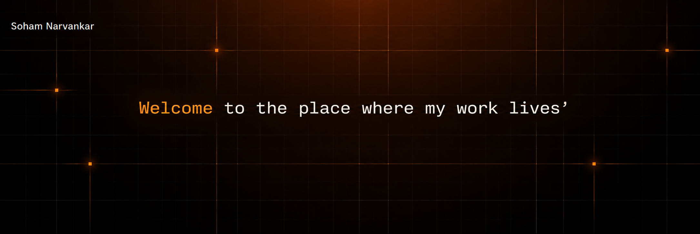

I'm a passionate **Computer Engineer** who loves building innovative solutions and exploring cutting-edge technologies.

 

 &nbsp;Mumbai, India &nbsp;&nbsp;•&nbsp;&nbsp;
 &nbsp;github.com/Sohamm24

 

###  &nbsp;Engineering Impact & Production Metrics

<table width="100%">
  <tr>
    <td align="center" width="25%">
       
      <h3>2</h3>
      <b>Real Projects Shipped</b> 
      For clients, at production scale
    </td>
    <td align="center" width="25%">
       
      <h3>35%</h3>
      <b>Latency Reduction</b> 
      Via KV edge caching & DB indexing under load
    </td>
    <td align="center" width="25%">
       
      <h3>15+</h3>
      <b>Zero-Downtime Releases</b> 
      AWS EC2, Docker & GitHub Actions CI/CD
    </td>
    <td align="center" width="25%">
       
      <h3>3x</h3>
      <b>Hackathon Finalist</b> 
      SIH, Hackoverflow 3.0 & Inspiron 4.0
    </td>
  </tr>
</table>

 

###  &nbsp;Tech Stack

<table>
<tr>
<td valign="top" width="18%"> &nbsp;<b>Cloud</b></td>
<td valign="top">

</td>
</tr>
<tr>
<td valign="top"> &nbsp;<b>Backend</b></td>
<td valign="top">

</td>
</tr>
<tr>
<td valign="top"> &nbsp;<b>Frontend</b></td>
<td valign="top">

</td>
</tr>
<tr>
<td valign="top"> &nbsp;<b>Database</b></td>
<td valign="top">

</td>
</tr>
<tr>
<td valign="top"> &nbsp;<b>DevOps & CI/CD</b></td>
<td valign="top">

</td>
</tr>
<tr>
<td valign="top"> &nbsp;<b>ORM</b></td>
<td valign="top">

</td>
</tr>
<tr>
<td valign="top"> &nbsp;<b>Other Tools</b></td>
<td valign="top">

</td>
</tr>
</table>

 

###  &nbsp;Featured Projects

<table width="100%">
<tr>
<td width="50%" valign="top">

 &nbsp;**APP DEVELOPMENT**

#### [Troupe — Travel Pinterest Backend](https://github.com/Sohamm24/Travel-Pinterest-Backend)
My real-world travel project — running at **production scale**.

       

</td>
<td width="50%" valign="top">

 &nbsp;**DEVOPS**

#### [Meal Subscription Portal](https://github.com/Sohamm24/meal-subscribtion-portal)
Jenkins & Selenium CI/CD pipeline built for a subscription platform.

  

</td>
</tr>
<tr>
<td width="50%" valign="top">

 &nbsp;**DATA ENGINEERING**

#### [CreatorIQ](https://github.com/Sohamm24/CreatorIQ)
Trend forecasting using YouTube signals, powered by the Prophet model.

  

</td>
<td width="50%" valign="top">

 &nbsp;**MACHINE LEARNING**

#### [Friend Recommendation via Graph Mining](https://github.com/Sohamm24/Social-Media-Friend-Recommendation-using-Graph-Mining)
Social media friend recommendation system using graph mining.

 

</td>
</tr>
<tr>
<td width="50%" valign="top">

 &nbsp;**DATA ANALYTICS**

#### [Customer Review Mining](https://github.com/Sohamm24/customer-review-mining)
Mining and analyzing customer reviews using NLP techniques.

 

</td>
<td width="50%" valign="top">

 &nbsp;**AGENTIC SECURITY**

#### [Zero Trust Support Agent](https://github.com/Sohamm24/customer-facing-ai-agent)
A zero-trust, agentic customer support assistant.

  

</td>
</tr>
</table>

 

###  &nbsp;Other Projects (Pinned)

| Project | Description |
|:--|:--|
| **[Fitguard Fitness App](https://github.com/Sohamm24/FitGaurd-Fitness-App)** | Track your anomalies |
| **[LangSQL](https://github.com/Sohamm24/LangSQL)** | Natural Language to SQL Query Compiler |
| **[Distributed Traffic Signal](https://github.com/Sohamm24/Distributed-Smart-City-Traffic-Management-System)** | RPC-based controller and manipulator |
| **[Veloxa](https://github.com/Sohamm24/Veloxa)** | Real-time meetings platform |

 

###  &nbsp;Honours & Certifications

| Credential / Recognition | Organization / Issuer | Details |
|:---|:---|:---|
| Cloud Computing Certification | CDAC | Certified in cloud computing fundamentals & practices |
| Technical Job Simulation | Deloitte | Completed job simulation focused on technical problem-solving |
| Digital Marketing Certification | IIDE | Certification in digital marketing fundamentals |
| Hackoverflow Hackathon (36 Hrs) | Pillai HOC College | Finalist — 36-hour hackathon |
| Inspiron Hackathon (24 Hrs) | COEP, Pune | Finalist — 24-hour hackathon |

 

###  &nbsp;GitHub Stats

  

 

###  &nbsp;Commit Activity — Year Wise

**2026**

**2025**

**2024**

